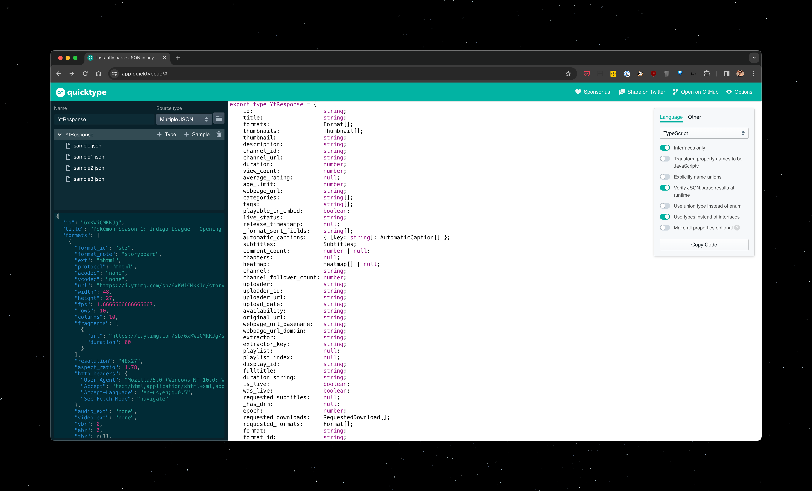

## How to generate types

1. Run the script for getting the fixtures:

```
$ node types/index.js
```

2. Go to [app.quicktype.io](https://app.quicktype.io/) and start pasting the fixtures to get the final types.

3. Update the types at src/index.d.ts
